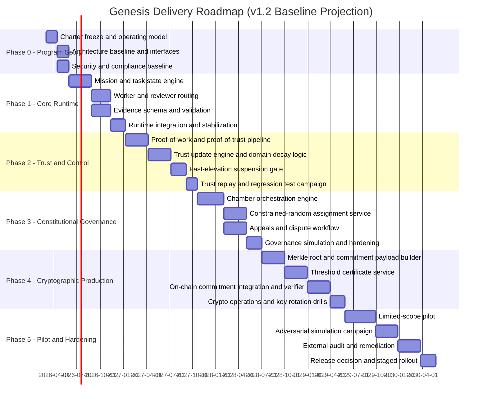
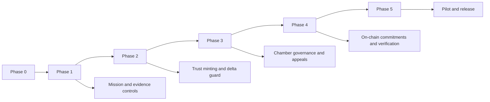

# Project Genesis Roadmap

Status: Execution roadmap (v1.2, baseline delivery projection)
Date: February 13, 2026
Owner: George Jackson

## 1. Roadmap intent

This roadmap converts the Genesis constitution and blueprint into a staged delivery plan with hard gates.

Execution rule:
1. No phase advances unless its exit gates are met.
2. Every gate must be evidenced by reproducible artifacts.
3. Governance and cryptographic controls are built in early, not deferred.

Planning rule:
1. Estimates are calibrated for a lean founding build.
2. Durations include build, integration, regression fixing, documentation, and review.
3. Constitutional and cryptographic controls are treated as delivery-critical, not optional polish.

---

## 2. Baseline delivery projection

Rule-of-thumb delivery window:
1. Optimistic: `24 months` (requires low rework and smooth audits).
2. Realistic: `30-42 months`.
3. Conservative: `48+ months` (if governance or security rework is heavy).

Planning assumptions:
1. Lean core implementation team with tightly controlled scope.
2. No large dedicated support team for QA, security, or compliance.
3. External audit and adversarial testing are mandatory before production release.
4. Fail-closed governance and cryptographic guarantees are non-negotiable.

---

## 3. Timeline chart (blueprint to production)

---

## 4. Phase plan with hard entry and exit gates

## Phase 0 - Program setup

Objective:
1. Lock scope, architecture boundaries, and governance authority map.

Entry gates:
1. Constitution and blueprint accepted.
2. Core parameter matrix loaded from canonical constitution.

Exit gates:
1. System context and interface contracts are versioned.
2. Risk register exists with owners and response playbooks.
3. Test plan defines pass/fail criteria for every critical invariant.
4. Threat model and invariants baseline is approved.

Deliverables:
1. Program charter.
2. Interface contract pack.
3. Risk register v1.
4. Estimate baseline and review cadence.
5. Threat model and invariants document.
6. Repository contribution-governance workflow.

---

## Phase 1 - Core runtime

Objective:
1. Deliver mission execution pipeline with independent review and evidence controls.

Entry gates:
1. Phase 0 exit complete.

Exit gates:
1. Mission/task state machine executes exactly as specified.
2. No self-review path exists for critical tasks.
3. Evidence schema enforcement blocks incomplete submissions.
4. Human final gate blocks completion for high-risk classes.
5. Two end-to-end worked examples (one low-risk, one high-risk) are reproducible from evidence.
6. Runtime policy resolver enforces mission-class-to-tier mapping.
7. Domain type classification (`objective`, `normative`, `mixed`) is enforced on all tasks.
8. Reviewer heterogeneity constraints are enforced per risk tier (model family and method type diversity).
9. Normative escalation triggers human adjudication when agreement < 60%.

Deliverables:
1. Mission engine service.
2. Task orchestration service.
3. Reviewer routing service (with heterogeneity enforcement).
4. Evidence validator.
5. Domain-type classification and normative escalation service.
6. Worked-example bundle with reproducibility pack.
7. Runtime policy map (`config/runtime_policy.json`).

Metrics:
1. Review bypass rate = 0.
2. Incomplete-evidence acceptance rate = 0.
3. Mission transition reproducibility = 100%.
4. Critical regression backlog at phase exit = 0.

---

## Phase 2 - Trust and control

Objective:
1. Implement trust minting, trust updates, and fast-elevation suspension controls.

Entry gates:
1. Phase 1 exit complete.

Exit gates:
1. Proof-of-work and proof-of-trust are separately validated primitives.
2. Trust minting only occurs from proof-of-trust evidence.
3. Any `DeltaT > delta_fast` event is suspended by default.
4. Revalidation requires quorum thresholds from constitution (`q_h`, `r_h`, `o_h`).
5. Parameter calibration report is complete and accepted for quality gates, re-certification, and decommission thresholds.
6. Automated invariant checks pass against executable policy artifacts.

Deliverables:
1. Trust engine.
2. Proof validation pipeline.
3. Domain decay and quarantine service (human dormancy and machine freshness).
4. Incident trigger and hold mechanism.
5. Calibration report and parameter sensitivity analysis pack.
6. Invariant-check automation script and baseline policy config.

Metrics:
1. Unauthorized trust mint attempts accepted = 0.
2. Fast-elevation unsuspended violations = 0.
3. Trust replay consistency from logs = 100%.
4. Parameter replay mismatch across environments = 0.
5. Quality-gate bypass rate (`Q < Q_min` with positive trust gain) = 0.

---

## Phase 3 - Constitutional governance

Objective:
1. Implement constitutional decision flow with anti-capture constraints.

Entry gates:
1. Phase 2 exit complete.

Exit gates:
1. Three-chamber voting flow executes with exact threshold logic.
2. Constrained-random selection is deterministic and externally replayable.
3. Region and organization constraints are enforced.
4. Conflict-of-interest recusal blocks ineligible actors.
5. Constitutional ballots include verified-human voters only (`w_M_const = 0`).
6. Genesis phase controller correctly identifies current phase (G0–G3) and enforces phase-appropriate chamber sizes and constraints.
7. Genesis phase transitions are one-way; time limits and population thresholds are enforced.
8. G0 retroactive ratification is enforceable within G1.

Deliverables:
1. Governance orchestration service.
2. Chamber assignment and eligibility snapshot service.
3. Appeals/dispute workflow service.
4. Genesis phase controller (phase detection, transition logic, time-limit enforcement).
5. Normative adjudication panel service.

Metrics:
1. Chamber replay mismatch rate = 0.
2. Constraint bypass rate = 0.
3. Invalid constitutional activation rate = 0.
4. Governance simulation capture escapes at configured threat model = 0.

---

## Phase 4 - Cryptographic production

Objective:
1. Make every critical governance and trust transition cryptographically verifiable.

Entry gates:
1. Phase 3 exit complete.

Exit gates:
1. Deterministic Merkle roots generated for all required domains.
2. Threshold decision certificates validate for constitutional changes.
3. On-chain commitment publication succeeds on configured cadence and event triggers.
4. External verifier reproduces roots and inclusion proofs from public data.
5. Progressive commitment tier controller correctly selects C0/C1/C2 based on participant count and enforces minimum L1 anchor frequency.
6. Constitutional lifecycle events anchor to L1 immediately regardless of commitment tier.
7. Commitment tier progression is one-way (no regression).

Deliverables:
1. Root builder.
2. Certificate service.
3. Commitment publisher (with progressive commitment tier support).
4. L2 rollup integration (for C0 and C1 tiers).
5. Commitment tier controller.
6. Public verifier toolkit.

Metrics:
1. Commitment publication failure rate < 0.1%.
2. Signature verification failure rate = 0 for valid records.
3. External verification reproducibility = 100%.
4. Key-rotation drill recovery time meets target runbook window.

---

## Phase 5 - Pilot and hardening

Objective:
1. Prove operational reliability under real load and adversarial conditions.

Entry gates:
1. Phase 4 exit complete.

Exit gates:
1. Pilot meets safety, reliability, and governance thresholds.
2. Adversarial simulation results remain within risk tolerance.
3. External audit closes all high-severity findings.
4. Go/no-go release decision is ratified and committed on-chain.

Deliverables:
1. Pilot report.
2. Red-team and adversarial test report.
3. External audit report.
4. Release decision package.

Metrics:
1. Critical control failures = 0.
2. Severe unresolved audit findings = 0.
3. Governance decision reproducibility = 100%.
4. Pilot rollback safety tests pass in all targeted scenarios.

---

## 5. Dependency map

---

## 6. Governance and parameter review checkpoints

Mandatory review checkpoints:
1. End of each phase.
2. Any high-severity incident.
3. Quarterly constitutional parameter review.
4. Any threat-model change trigger.

Parameters requiring explicit review evidence:
1. `q_h`, `r_h`, `o_h` (including genesis-scaled values).
2. Chamber thresholds and chamber sizes (including genesis-phase chambers G1/G2).
3. Region and organization concentration controls (including genesis-phase `c_max`).
4. Crypto key rotation and commitment committee threshold.
5. Threat-model and invariants updates tied to new attack paths.
6. Genesis phase time limits (`G0_MAX_DAYS`, `G0_EXTENSION_DAYS`, `G1_MAX_DAYS`).
7. Commitment tier anchor intervals (`C0_L1_anchor_interval_hours`, `C1_L1_anchor_interval_hours`).
8. Reviewer heterogeneity thresholds (`H_R2_MODEL_FAMILIES`, `H_R2_METHOD_TYPES`).
9. Normative resolution parameters (`NORMATIVE_AGREEMENT_THRESHOLD`, `NORMATIVE_PANEL_SIZE`).

No parameter changes are valid unless:
1. Change rationale is documented.
2. Multi-chamber human ratification passes.
3. Change is signed, versioned, and committed on-chain.

---

## 7. Realism notes for stakeholders

To keep expectations grounded:
1. The roadmap is intentionally paced for correctness and legitimacy, not speed theater.
2. Governance, cryptography, and auditability add substantial engineering and verification time.
3. A single developer can build this, but production trust requires long-cycle testing and external scrutiny.
4. Attempting to compress this schedule materially increases capture, security, and correctness risk.

---

## 8. Stop condition for roadmap expansion

To avoid repository bloat:
1. This is the only roadmap document.
2. Updates are made in-place by versioning this file.
3. New roadmap files are prohibited unless a new legal-risk class is introduced.

\* subject to review
