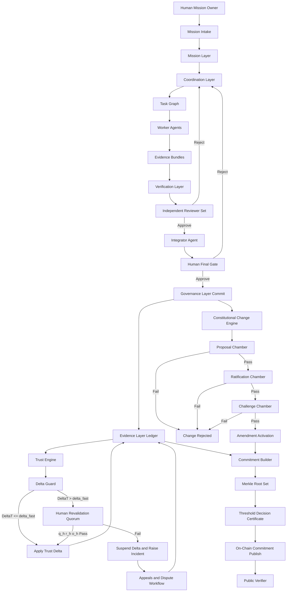
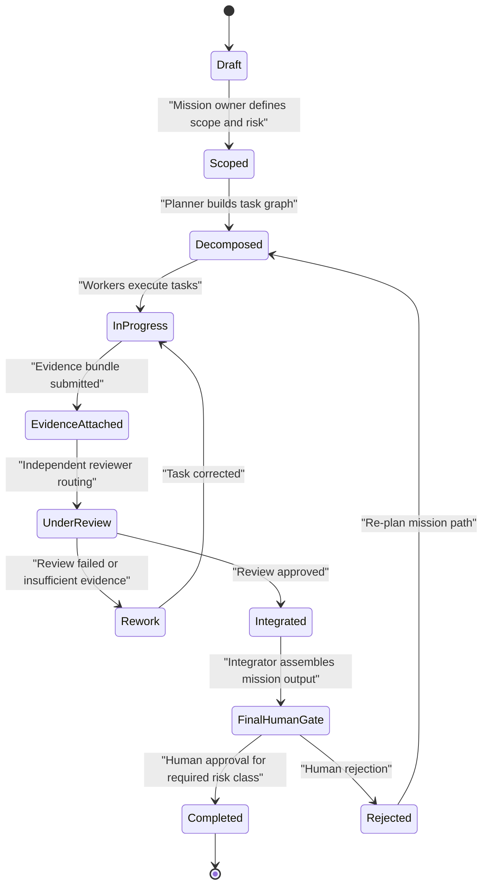
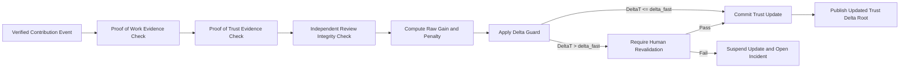
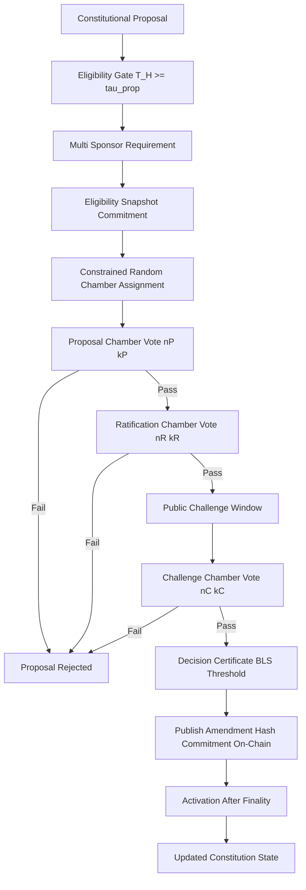
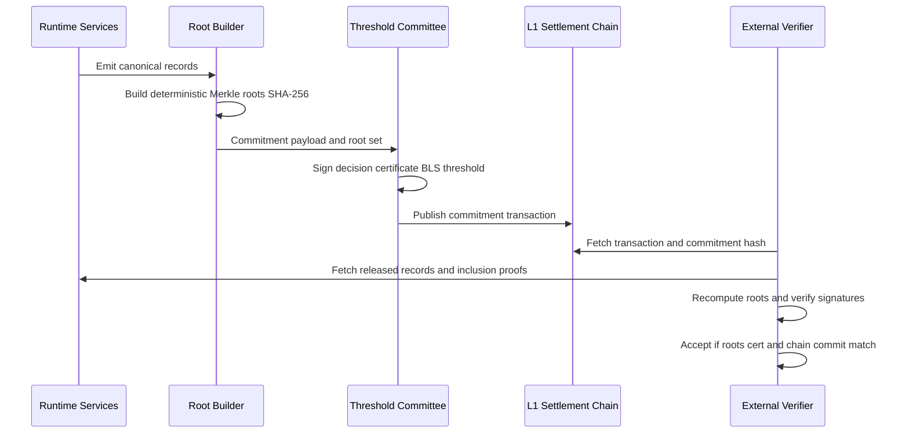

# Project Genesis System Blueprint

Status: Draft blueprint for review before commit (v0.2)
Date: February 13, 2026
Owner: George Jackson

## 1. Blueprint objective

This document defines how the Genesis moving parts work together as one executable system.

Design target:
1. Mission execution must be fast and auditable.
2. Trust must be minted only from cryptographically verifiable, independently reviewed evidence.
3. Constitutional control must remain distributed and anti-capture by construction.
4. Every critical transition must fail closed when validation is incomplete.

Canonical parameter source:
1. `TRUST_CONSTITUTION.md` remains the sole source of parameter truth.
2. This blueprint describes mechanism wiring, execution flow, and verification logic.

---

## 2. End-to-end interaction chart



---

## 3. Mission and task state machine



Operational rule:
1. No mission in a designated high-risk class can transition to `Completed` without human final approval.

---

## 4. Trust computation and minting pipeline



### 4.1 Trust math

Definitions:
1. `T_H(i)` human constitutional trust for actor `i`.
2. `T_M(j)` machine operational trust for actor `j`.
3. `T_cap_H = min(T_abs_max_H, mean(T_H) + k_H * std(T_H))`.
4. `T_cap_M = T_abs_max_M`.

Update:
1. `T_H_next = clip(T_H_now + gain_H - penalty_H - dormancy_decay_H, T_floor_H, T_cap_H)`.
2. `T_M_next = clip(T_M_now + gain_M - penalty_M - freshness_decay_M, 0, T_cap_M)`.
3. `gain_H` and `gain_M` can only be produced from proof-of-trust evidence.
4. Machine freshness decay includes verification age and environment drift.

Hard rules:
1. Proof-of-work evidence proves work occurred.
2. Proof-of-trust evidence proves independently verified quality and policy compliance over time.
3. Proof-of-work evidence alone cannot mint trust.
4. Human trust cannot fall below a non-zero floor (`T_floor_H > 0`).
5. Machine trust may decay to zero (`T_floor_M = 0`); `T_M = 0` triggers operational quarantine and supervised re-certification before privileged re-entry.

### 4.2 Fast elevation gate

Gate trigger:
1. If `DeltaT > delta_fast` in one epoch, update is suspended.

Current default thresholds (full constitutional mode, G3):
1. `delta_fast = 0.02`.
2. `q_h >= 30*` independent high-trust human signatures.
3. `r_h >= 3` regions represented.
4. `o_h >= 3` organizations represented.

Genesis-phase scaled thresholds:
1. G1 (50–500 participants): `q_h = 7, r_h = 2, o_h = 2`.
2. G2 (500–2000 participants): `q_h = 15, r_h = 3, o_h = 3`.
3. G3 (2000+ participants): full constitutional thresholds apply.

### 4.3 Risk-tier review policy

Risk-tier execution profile:

| Risk tier | Default review topology | Pass rule | Heterogeneity | Extra controls |
| --- | --- | --- | --- | --- |
| `R0` (low) | `1 worker + 1 reviewer` | Reviewer approval | No constraint | Evidence schema required |
| `R1` (moderate) | `1 worker + 2 reviewers` | `2/2` approval | `≥ 2` model families | Reviewer non-overlap and conflict checks |
| `R2` (high) | `1 worker + 5 reviewers` | `>= 4/5` approval | `≥ 2` model families, `≥ 2` method types | `>= 3` regions, `>= 3` organizations, mandatory human final gate |
| `R3` (constitutional) | Human chambers only | Chamber thresholds in constitution | N/A (human only) | Machine vote weight fixed at `0` |

Hard policy:
1. Trust gain is quality-gated at every tier; if `Q < Q_min`, no trust minting occurs.
2. Swarm review is reserved for higher-risk tiers and cannot be used as a truth oracle by itself.
3. Subjective or normative disputes escalate to human adjudication even when reviewer quorum passes.
4. Every reviewer must declare `model_family` and `method_type` metadata. Valid method types: `{reasoning_model, retrieval_augmented, rule_based_deterministic, human_reviewer}`.
5. Every task must be classified by `domain_type`: `objective` (factual), `normative` (value-laden), or `mixed`. Normative and mixed tasks require human adjudication when agreement falls below `NORMATIVE_AGREEMENT_THRESHOLD = 0.60`.

### 4.4 Identity-signal policy

Identity signals are support controls, not authority controls.

1. Proof-of-personhood/proof-of-agenthood, timing profiles, and hardware attestations can raise abuse alerts.
2. Identity signals alone cannot grant trust gain, privileged routing, or constitutional authority.
3. High-risk decisions require layered evidence: identity history, policy compliance history, independent review, and auditable records.

### 4.5 Runtime policy mapping (executable)

Canonical runtime policy artifacts:
1. `config/runtime_policy.json` (mission-class-to-tier mapping and review topology).
2. `config/constitutional_params.json` (machine-readable constitutional parameter mirror).

Default mission class mapping:
1. `documentation_update -> R0`
2. `internal_operations_change -> R1`
3. `regulated_analysis -> R2`
4. `constitutional_change -> R3`

Execution requirement:
1. Runtime must resolve mission class to risk tier using `config/runtime_policy.json`.
2. Runtime must reject mission execution if mission class is unmapped.
3. Runtime must reject mission execution if requested review topology is weaker than tier minimum.
4. Runtime must reject any non-human constitutional voting path (`R3` must remain human-only).

---

## 5. Constitutional governance flow



Pass conditions:
1. All required chambers pass threshold.
2. Geographic and organization distribution constraints pass.
3. Non-overlap and conflict-of-interest rules pass.
4. Certificate verifies and chain commitment reaches finality.
5. Machine constitutional voting weight remains `w_M_const = 0` for all ballots.

### 5.1 Genesis bootstrap protocol

The full constitutional governance flow (above) requires chamber sizes of 41/61/101. Before the participant pool reaches those thresholds, the system operates under a phased genesis protocol:

| Phase | Participants | Chamber sizes (P/R/C) | Geographic constraint | Time limit |
| --- | --- | --- | --- | --- |
| G0 (founder stewardship) | 0–50 | No chambers; founder operates under constitutional principles with public audit trail | N/A | 365 days (+180d extension, one-time) |
| G1 (provisional chambers) | 50–500 | 11 / 17 / 25 | ≥ 3 regions, c_max = 0.40 | 730 days |
| G2 (scaled chambers) | 500–2000 | 21 / 31 / 51 | ≥ 5 regions, c_max = 0.25 | None (advances on threshold) |
| G3 (full constitution) | 2000+ | 41 / 61 / 101 | ≥ 8 regions, per constitution | Steady state |

Hard rules:
1. Phase transitions are one-way; regression to an earlier phase is prohibited.
2. All G0 provisional decisions must be retroactively ratified by G1 chambers within 90 days of G1 activation.
3. The founder loses veto power the moment G1 chambers activate.
4. If G0 exceeds its time limit without reaching 50 participants, the project fails closed.

---

## 6. Cryptographic commitments and external verification flow



Binding crypto defaults:
1. Settlement chain: Ethereum Mainnet (`chain_id = 1`).
2. Hash function: `SHA-256`.
3. Identity and event signatures: `Ed25519`.
4. Decision certificate: threshold `BLS12-381`.
5. Canonical JSON: RFC 8785.
6. Sampling seed for constrained-random assignment: `SHA256(public_beacon_value || previous_commitment_hash || chamber_nonce)`.

Progressive commitment strategy:
1. **C0** (≤ 500 participants): L2 rollup primary, L1 anchor every 24 hours. Constitutional lifecycle events anchor to L1 immediately.
2. **C1** (500–5000 participants): L2 rollup primary, L1 anchor every 6 hours. Constitutional lifecycle events anchor to L1 immediately.
3. **C2** (5000+ participants): Full L1 hourly commitments plus event-triggered commitments for constitutional lifecycle events.
4. All commitment tiers maintain identical cryptographic integrity — only anchor frequency changes.
5. Commitment tier progression is one-way (C0 → C1 → C2); regression is prohibited.

---

## 7. Deterministic constrained-random chamber selection

```python
def select_chamber_members(
    eligible_pool,
    chamber_size,
    public_beacon_value,
    previous_commitment_hash,
    chamber_nonce,
    region_cap,
    min_regions,
    min_orgs,
    recusal_set,
):
    # 1) Pre-committed seed
    seed = sha256(public_beacon_value + previous_commitment_hash + chamber_nonce)

    # 2) Deterministic ranking
    ranked = sorted(
        [a for a in eligible_pool if a.id not in recusal_set],
        key=lambda a: sha256(seed + a.id),
    )

    selected = []
    region_count = {}
    org_count = {}

    # 3) Deterministic sampling without replacement with hard constraints
    for actor in ranked:
        if len(selected) == chamber_size:
            break

        if violates_region_cap(actor, selected, region_cap):
            continue
        if violates_conflict_rules(actor):
            continue

        selected.append(actor)
        region_count[actor.region] = region_count.get(actor.region, 0) + 1
        org_count[actor.org] = org_count.get(actor.org, 0) + 1

    # 4) Fail closed if diversity constraints not met
    if len(selected) < chamber_size:
        raise FailClosed("insufficient eligible participants")
    if len(region_count) < min_regions:
        raise FailClosed("region diversity constraint failed")
    if len(org_count) < min_orgs:
        raise FailClosed("organization diversity constraint failed")

    return selected
```

Fail-closed principle:
1. If constraints cannot be satisfied deterministically, selection does not proceed.
2. Governance action remains blocked until constraints are satisfiable.

---

## 8. Control matrix (inputs outputs invariants failure gates)

| Subsystem | Inputs | Outputs | Invariants | Fail-closed gate |
| --- | --- | --- | --- | --- |
| Mission intake | Human mission spec, risk class | Mission record | Required fields complete, risk class present | Reject incomplete mission |
| Risk-tier resolver | Mission class, runtime policy map | Effective risk tier and review topology | Mission class must map to tier, topology must meet tier minimums | Block mission activation |
| Task coordination | Mission record, dependency rules | Task graph | DAG validity, no orphan tasks | Block graph activation |
| Worker execution | Task assignment | Output plus evidence bundle | Evidence schema completeness | Reject submission |
| Independent review | Output plus evidence | Approve reject rework decision | No self-review, reviewer independence | Route to rework |
| Trust minting | Verified events plus review outcomes | Trust delta | Proof-of-trust required, PoW alone insufficient | Suspend trust update |
| Machine lifecycle | Trust state plus re-cert evidence | Active, quarantined, or decommissioned machine state | `T_M = 0` quarantine, re-cert thresholds, decommission thresholds | Block privileged routing |
| Fast elevation guard | Proposed trust delta | Applied or suspended delta | `DeltaT <= delta_fast` or quorum path | Open incident and hold delta |
| Constitutional governance | Proposal and eligibility snapshot | Approved or rejected amendment | Chamber thresholds and distribution constraints | Reject amendment |
| Blockchain commitments | Roots plus certificates | On-chain commitment | Deterministic root reproducibility | Block commit |
| Verification | Public records and proofs | Validation report | Signature and inclusion proof validity | Mark state unverifiable |
| Appeals and disputes | Incident or challenge request | Overturn or uphold decision | Signed audit trail and reason codes | Keep prior state active |
| Genesis phase controller | Participant count, phase clock | Phase transition or fail-closed | Hard time limits, one-way transitions, retroactive ratification | Block operations if phase expired |
| Reviewer heterogeneity gate | Reviewer set metadata | Accept or reject reviewer assignment | Model family and method type diversity per tier | Block review if diversity insufficient |
| Normative resolution | Task domain_type, reviewer agreement | Human adjudication or auto-close | Normative tasks require human panel | Escalate to adjudication |
| Commitment tier controller | Participant count, L1 anchor schedule | Anchor transaction | Minimum anchor frequency per tier, no regression | Force immediate anchor for lifecycle events |

---

## 9. Minimum implementation contract

A deployment is not valid unless all are true:
1. Every trust-affecting event is signed and commitment-linked.
2. Every constitutional event is chamber-gated and certificate-signed.
3. Every constrained-random assignment can be independently replayed.
4. Every critical state transition is auditable from public commitments.
5. Any verification failure leaves state unchanged until resolved.
6. Threat-model invariants in `THREAT_MODEL_AND_INVARIANTS.md` (all 28 invariants, v0.2) are satisfied.
7. At least one low-risk and one high-risk mission flow are reproducible end-to-end from evidence.
8. `tools/check_invariants.py` and `tools/verify_examples.py` both pass against repository policy artifacts.
9. Genesis phase is correctly identified and enforced based on current participant count.
10. Reviewer heterogeneity constraints are enforced per risk tier (model family and method type diversity).
11. Domain type classification is present on all tasks; normative tasks trigger human adjudication when agreement is below threshold.
12. Commitment tier is correctly identified and L1 anchor frequency meets or exceeds tier minimum.

---

## 10. Review notes

Parameters marked with `*` are intentionally flagged for further human review.

Current flagged parameter:
1. `q_h = 30*` (full constitution G3 threshold; genesis-phase values G1=7, G2=15 are derived from population scaling).

\* subject to review

Version history:
1. v0.1 — initial blueprint with core trust, review, and governance mechanisms.
2. v0.2 — added genesis bootstrap protocol (§5.1), progressive commitment strategy (§6), reviewer heterogeneity (§4.3), normative dispute resolution (§4.3), genesis-scaled fast-elevation thresholds (§4.2), and updated control matrix (§8).
