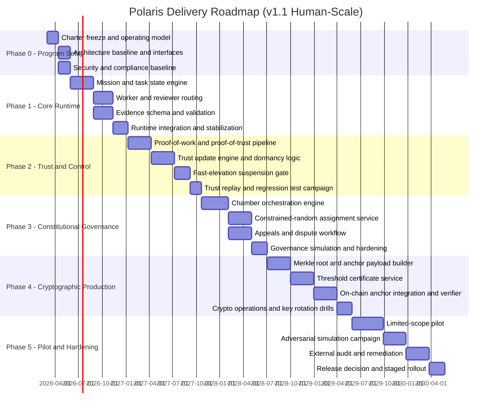
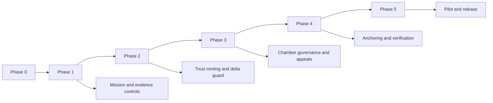

# Project Polaris Roadmap

Status: Execution roadmap (v1.1, human-scale projection)  
Date: February 13, 2026  
Owner: George Jackson

## 1. Roadmap intent

This roadmap converts the Polaris constitution and blueprint into a staged delivery plan with hard gates.

Execution rule:
1. No phase advances unless its exit gates are met.
2. Every gate must be evidenced by reproducible artifacts.
3. Governance and cryptographic controls are built in early, not deferred.

Human-scale planning rule:
1. Estimates are calibrated for one skilled full-time developer.
2. Durations include build, integration, regression fixing, documentation, and review.
3. Constitutional and cryptographic controls are treated as delivery-critical, not optional polish.

---

## 2. Human-scale projection (single skilled developer)

Rule-of-thumb delivery window:
1. Optimistic: `24 months` (requires low rework and smooth audits).
2. Realistic: `30-42 months`.
3. Conservative: `48+ months` (if governance or security rework is heavy).

Planning assumptions:
1. One skilled developer working full-time.
2. No large dedicated support team for QA, security, or compliance.
3. External audit and adversarial testing are mandatory before production release.
4. Fail-closed governance and cryptographic guarantees are non-negotiable.

---

## 3. Timeline chart (human-scale, blueprint to production)

---

## 4. Phase plan with hard entry and exit gates

## Phase 0 - Program setup

Objective:
1. Lock scope, architecture boundaries, and governance authority map.

Entry gates:
1. Constitution and blueprint accepted.
2. Core parameter matrix loaded from canonical constitution.

Exit gates:
1. System context and interface contracts are versioned.
2. Risk register exists with owners and response playbooks.
3. Test plan defines pass/fail criteria for every critical invariant.

Deliverables:
1. Program charter.
2. Interface contract pack.
3. Risk register v1.
4. Human-scale estimate baseline and review cadence.

---

## Phase 1 - Core runtime

Objective:
1. Deliver mission execution pipeline with independent review and evidence controls.

Entry gates:
1. Phase 0 exit complete.

Exit gates:
1. Mission/task state machine executes exactly as specified.
2. No self-review path exists for critical tasks.
3. Evidence schema enforcement blocks incomplete submissions.
4. Human final gate blocks completion for high-risk classes.

Deliverables:
1. Mission engine service.
2. Task orchestration service.
3. Reviewer routing service.
4. Evidence validator.

Metrics:
1. Review bypass rate = 0.
2. Incomplete-evidence acceptance rate = 0.
3. Mission transition reproducibility = 100%.
4. Critical regression backlog at phase exit = 0.

---

## Phase 2 - Trust and control

Objective:
1. Implement trust minting, trust updates, and fast-elevation suspension controls.

Entry gates:
1. Phase 1 exit complete.

Exit gates:
1. Proof-of-work and proof-of-trust are separately validated primitives.
2. Trust minting only occurs from proof-of-trust evidence.
3. Any `DeltaT > delta_fast` event is suspended by default.
4. Revalidation requires quorum thresholds from constitution (`q_h`, `r_h`, `o_h`).

Deliverables:
1. Trust engine.
2. Proof validation pipeline.
3. Delta guard service.
4. Incident trigger and hold mechanism.

Metrics:
1. Unauthorized trust mint attempts accepted = 0.
2. Fast-elevation unsuspended violations = 0.
3. Trust replay consistency from logs = 100%.
4. Parameter replay mismatch across environments = 0.

---

## Phase 3 - Constitutional governance

Objective:
1. Implement constitutional decision flow with anti-capture constraints.

Entry gates:
1. Phase 2 exit complete.

Exit gates:
1. Three-chamber voting flow executes with exact threshold logic.
2. Constrained-random selection is deterministic and externally replayable.
3. Region and organization constraints are enforced.
4. Conflict-of-interest recusal blocks ineligible actors.
5. Constitutional ballots include verified-human voters only (`w_M_const = 0`).

Deliverables:
1. Governance orchestration service.
2. Chamber assignment and eligibility snapshot service.
3. Appeals/dispute workflow service.

Metrics:
1. Chamber replay mismatch rate = 0.
2. Constraint bypass rate = 0.
3. Invalid constitutional activation rate = 0.
4. Governance simulation capture escapes at configured threat model = 0.

---

## Phase 4 - Cryptographic production

Objective:
1. Make every critical governance and trust transition cryptographically verifiable.

Entry gates:
1. Phase 3 exit complete.

Exit gates:
1. Deterministic Merkle roots generated for all required domains.
2. Threshold decision certificates validate for constitutional changes.
3. On-chain anchor publication succeeds on configured cadence and event triggers.
4. External verifier reproduces roots and inclusion proofs from public data.

Deliverables:
1. Root builder.
2. Certificate service.
3. Anchor publisher.
4. Public verifier toolkit.

Metrics:
1. Anchor publication failure rate < 0.1%.
2. Signature verification failure rate = 0 for valid records.
3. External verification reproducibility = 100%.
4. Key-rotation drill recovery time meets target runbook window.

---

## Phase 5 - Pilot and hardening

Objective:
1. Prove operational reliability under real load and adversarial conditions.

Entry gates:
1. Phase 4 exit complete.

Exit gates:
1. Pilot meets safety, reliability, and governance thresholds.
2. Adversarial simulation results remain within risk tolerance.
3. External audit closes all high-severity findings.
4. Go/no-go release decision is ratified and anchor-committed.

Deliverables:
1. Pilot report.
2. Red-team and adversarial test report.
3. External audit report.
4. Release decision package.

Metrics:
1. Critical control failures = 0.
2. Severe unresolved audit findings = 0.
3. Governance decision reproducibility = 100%.
4. Pilot rollback safety tests pass in all targeted scenarios.

---

## 5. Dependency map

---

## 6. Governance and parameter review checkpoints

Mandatory review checkpoints:
1. End of each phase.
2. Any high-severity incident.
3. Quarterly constitutional parameter review.

Parameters requiring explicit review evidence:
1. `q_h`, `r_h`, `o_h`.
2. Chamber thresholds and chamber sizes.
3. Region and organization concentration controls.
4. Crypto key rotation and anchor committee threshold.

No parameter changes are valid unless:
1. Change rationale is documented.
2. Multi-chamber human ratification passes.
3. Change is signed, versioned, and anchor-committed.

---

## 7. Realism notes for stakeholders

To keep expectations grounded:
1. The roadmap is intentionally paced for correctness and legitimacy, not speed theater.
2. Governance, cryptography, and auditability add substantial engineering and verification time.
3. A single developer can build this, but production trust requires long-cycle testing and external scrutiny.
4. Attempting to compress this schedule materially increases capture, security, and correctness risk.

---

## 8. Stop condition for roadmap expansion

To avoid repository bloat:
1. This is the only roadmap document.
2. Updates are made in-place by versioning this file.
3. New roadmap files are prohibited unless a new legal-risk class is introduced.

\* subject to review
