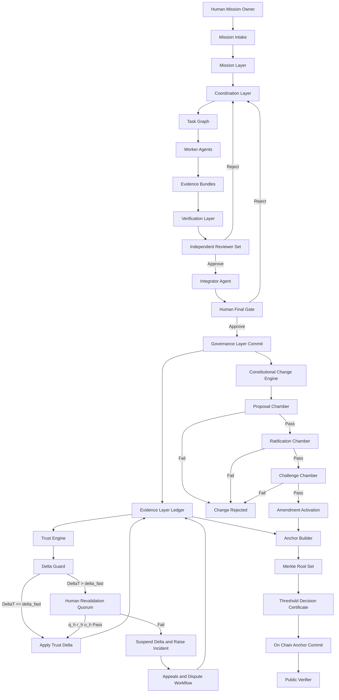
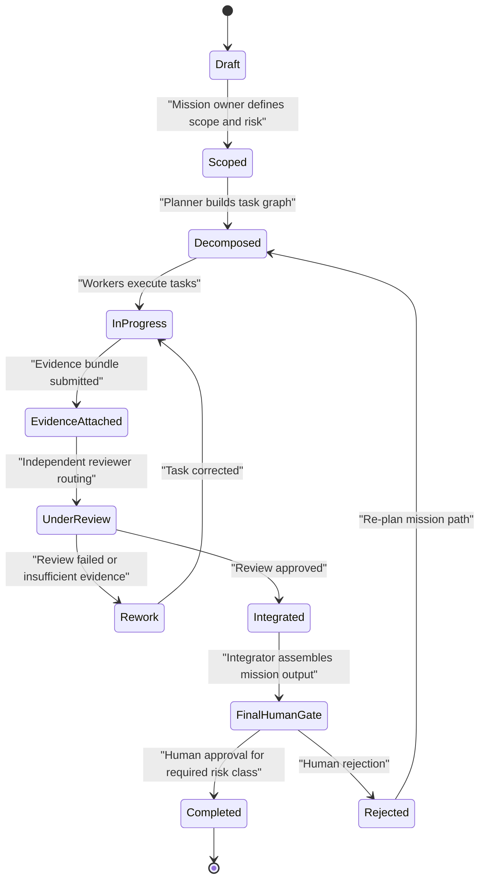
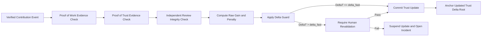
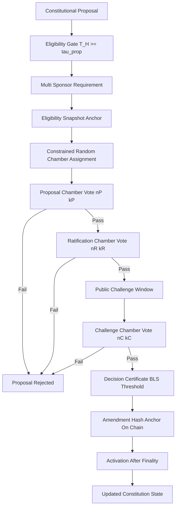
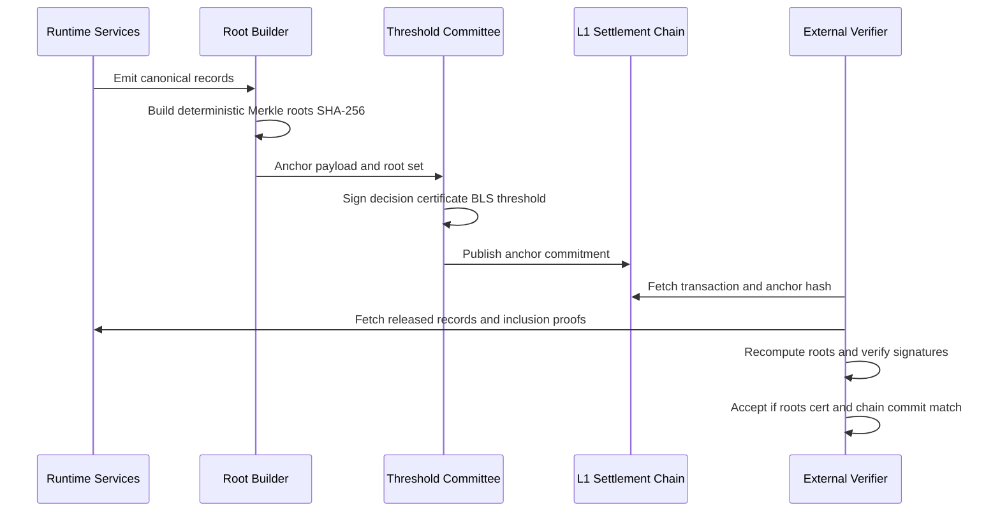

# Project Polaris System Blueprint

Status: Draft blueprint for review before commit  
Date: February 13, 2026  
Owner: George Jackson

## 1. Blueprint objective

This document defines how the Polaris moving parts work together as one executable system.

Design target:
1. Mission execution must be fast and auditable.
2. Trust must be minted only from cryptographically verifiable, independently reviewed evidence.
3. Constitutional control must remain distributed and anti-capture by construction.
4. Every critical transition must fail closed when validation is incomplete.

Canonical parameter source:
1. `TRUST_CONSTITUTION.md` remains the sole source of parameter truth.
2. This blueprint describes mechanism wiring, execution flow, and verification logic.

---

## 2. End-to-end interaction chart



---

## 3. Mission and task state machine



Operational rule:
1. No mission in a designated high-risk class can transition to `Completed` without human final approval.

---

## 4. Trust computation and minting pipeline



### 4.1 Trust math

Definitions:
1. `T_H(i)` human constitutional trust for actor `i`.
2. `T_M(j)` machine operational trust for actor `j`.
3. `T_cap = min(T_abs_max, mean(T_H) + k * std(T_H))`.

Update:
1. `T_next_raw = T_now + gain - penalty - dormancy_decay`.
2. `T_next = clip(T_next_raw, T_floor, T_cap)`.
3. `gain = min(alpha * verified_quality, u_max)` and can only be produced from proof-of-trust evidence.

Hard rules:
1. Proof-of-work evidence proves work occurred.
2. Proof-of-trust evidence proves independently verified quality and policy compliance over time.
3. Proof-of-work evidence alone cannot mint trust.

### 4.2 Fast elevation gate

Gate trigger:
1. If `DeltaT > delta_fast` in one epoch, update is suspended.

Current default thresholds:
1. `delta_fast = 0.02`.
2. `q_h >= 30*` independent high-trust human signatures.
3. `r_h >= 3` regions represented.
4. `o_h >= 3` organizations represented.

---

## 5. Constitutional governance flow



Pass conditions:
1. All required chambers pass threshold.
2. Geographic and organization distribution constraints pass.
3. Non-overlap and conflict-of-interest rules pass.
4. Certificate verifies and chain anchor finalizes.

---

## 6. Cryptographic anchoring and external verification flow



Binding crypto defaults:
1. Settlement chain: Ethereum Mainnet (`chain_id = 1`).
2. Anchor interval: `1 hour` plus event-triggered anchors for constitutional lifecycle events.
3. Hash function: `SHA-256`.
4. Identity and event signatures: `Ed25519`.
5. Decision certificate: threshold `BLS12-381`.
6. Canonical JSON: RFC 8785.
7. Sampling seed for constrained-random assignment: `SHA256(public_beacon_value || previous_anchor_hash || chamber_nonce)`.

---

## 7. Deterministic constrained-random chamber selection

```python
def select_chamber_members(
    eligible_pool,
    chamber_size,
    public_beacon_value,
    previous_anchor_hash,
    chamber_nonce,
    region_cap,
    min_regions,
    min_orgs,
    recusal_set,
):
    # 1) Pre-committed seed
    seed = sha256(public_beacon_value + previous_anchor_hash + chamber_nonce)

    # 2) Deterministic ranking
    ranked = sorted(
        [a for a in eligible_pool if a.id not in recusal_set],
        key=lambda a: sha256(seed + a.id),
    )

    selected = []
    region_count = {}
    org_count = {}

    # 3) Deterministic sampling without replacement with hard constraints
    for actor in ranked:
        if len(selected) == chamber_size:
            break

        if violates_region_cap(actor, selected, region_cap):
            continue
        if violates_conflict_rules(actor):
            continue

        selected.append(actor)
        region_count[actor.region] = region_count.get(actor.region, 0) + 1
        org_count[actor.org] = org_count.get(actor.org, 0) + 1

    # 4) Fail closed if diversity constraints not met
    if len(selected) < chamber_size:
        raise FailClosed("insufficient eligible participants")
    if len(region_count) < min_regions:
        raise FailClosed("region diversity constraint failed")
    if len(org_count) < min_orgs:
        raise FailClosed("organization diversity constraint failed")

    return selected
```

Fail-closed principle:
1. If constraints cannot be satisfied deterministically, selection does not proceed.
2. Governance action remains blocked until constraints are satisfiable.

---

## 8. Control matrix (inputs outputs invariants failure gates)

| Subsystem | Inputs | Outputs | Invariants | Fail-closed gate |
| --- | --- | --- | --- | --- |
| Mission intake | Human mission spec, risk class | Mission record | Required fields complete, risk class present | Reject incomplete mission |
| Task coordination | Mission record, dependency rules | Task graph | DAG validity, no orphan tasks | Block graph activation |
| Worker execution | Task assignment | Output plus evidence bundle | Evidence schema completeness | Reject submission |
| Independent review | Output plus evidence | Approve reject rework decision | No self-review, reviewer independence | Route to rework |
| Trust minting | Verified events plus review outcomes | Trust delta | Proof-of-trust required, PoW alone insufficient | Suspend trust update |
| Fast elevation guard | Proposed trust delta | Applied or suspended delta | `DeltaT <= delta_fast` or quorum path | Open incident and hold delta |
| Constitutional governance | Proposal and eligibility snapshot | Approved or rejected amendment | Chamber thresholds and distribution constraints | Reject amendment |
| Anchoring | Roots plus certificates | On-chain commitment | Deterministic root reproducibility | Block commit |
| Verification | Public records and proofs | Validation report | Signature and inclusion proof validity | Mark state unverifiable |
| Appeals and disputes | Incident or challenge request | Overturn or uphold decision | Signed audit trail and reason codes | Keep prior state active |

---

## 9. Minimum implementation contract

A deployment is not valid unless all are true:
1. Every trust-affecting event is signed and anchor-linked.
2. Every constitutional event is chamber-gated and certificate-signed.
3. Every constrained-random assignment can be independently replayed.
4. Every critical state transition is auditable from public commitments.
5. Any verification failure leaves state unchanged until resolved.

---

## 10. Review notes

Parameters marked with `*` are intentionally flagged for further human review.

Current flagged parameter:
1. `q_h = 30*`

\* subject to review
